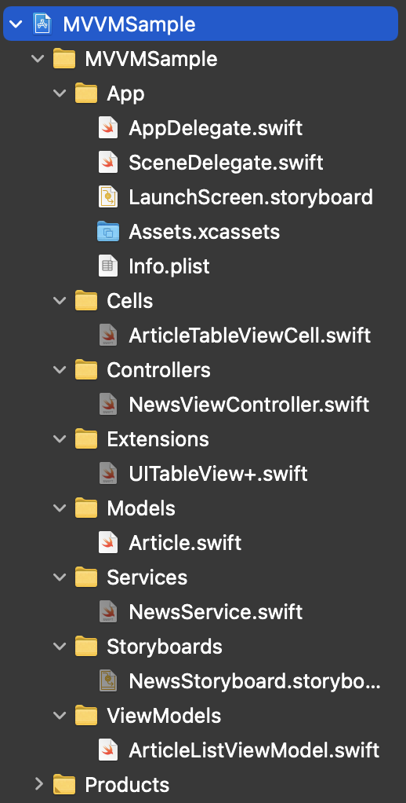

# iOS-MVVM-Sample(1)

다음 프로젝트는 [최강훈님 깃허브 MVVM_Practice](https://github.com/ChoiKanghun/MVVM_Practice)를 보고 연습해 본 프로젝트입니다.

## 코멘트

> "완벽한 아키텍처는 없다", 기억하면서 공부합시다 ~

정말 가장 기본적인 예제로 MVVM을 맛볼 수 있어서 좋은 예제인 것 같습니다.  
물론 추가적으로 실험해보고 공부할 필요는 있겠습니다.

## 폴더링

